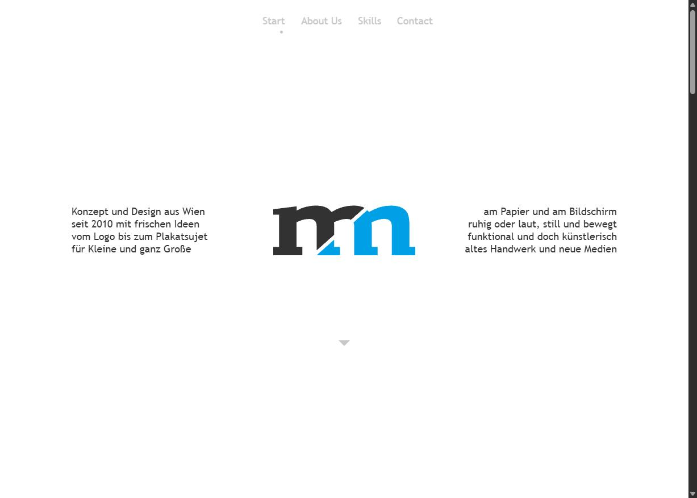
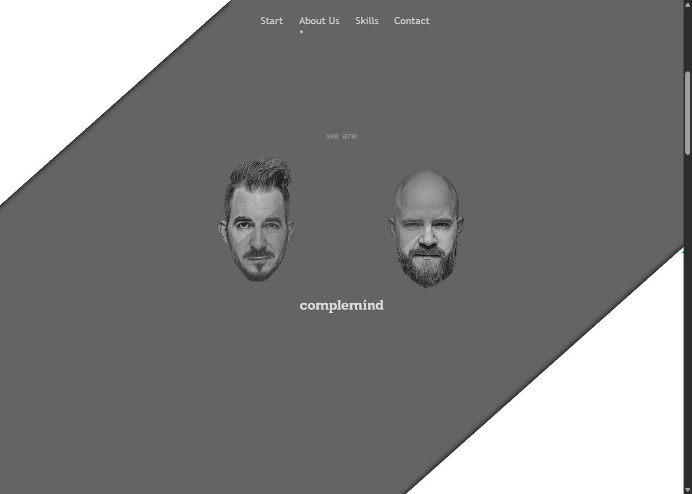
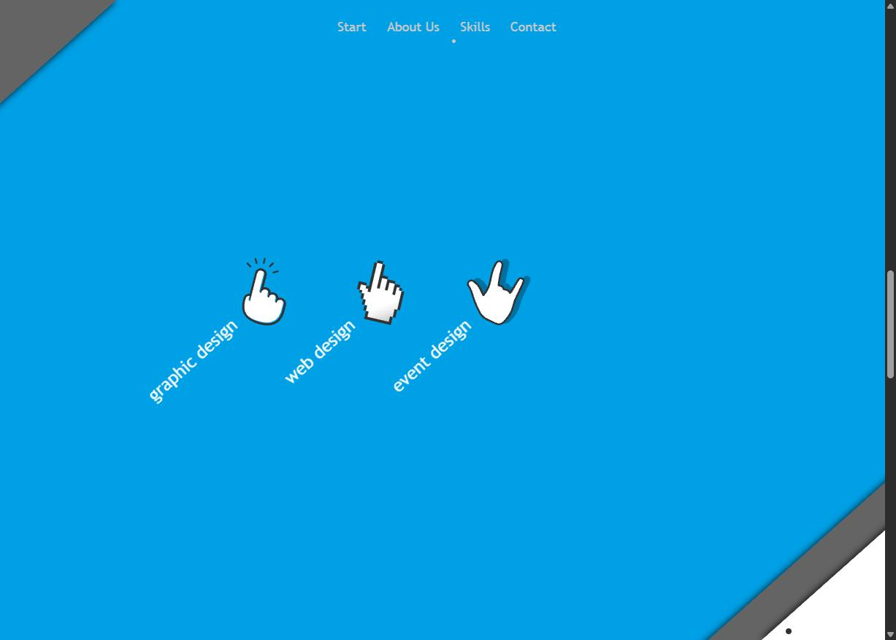
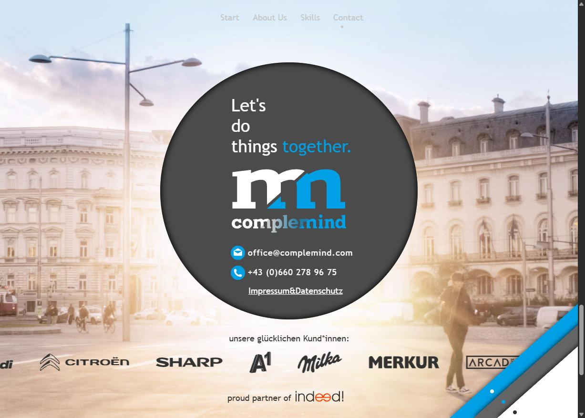
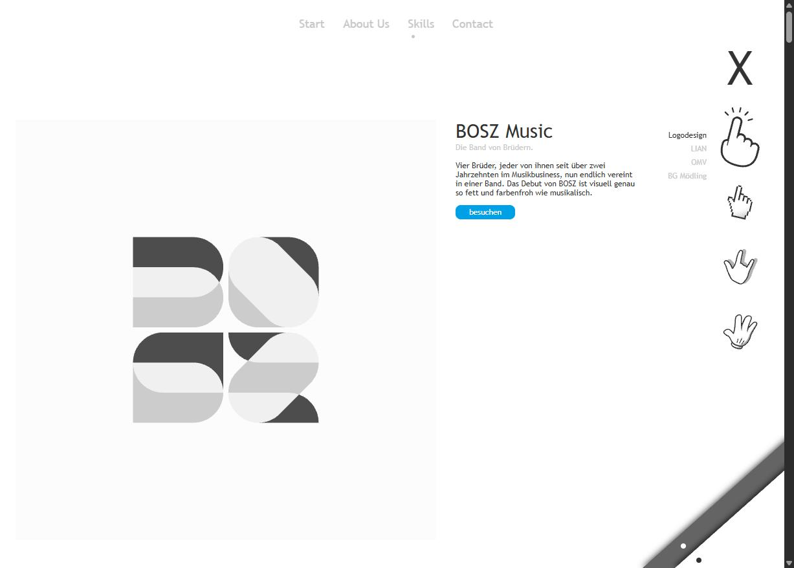
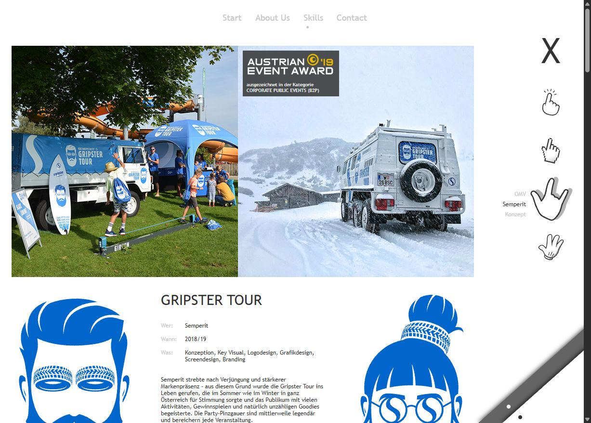

<div align="center">


### Konzept und Design aus Wien – seit 2010 mit frischen Ideen


**[complemind.com](https://www.complemind.com/)** · Graphic Design · Web Design · Event Design · Illustration

</div>

---



## ✨ Was ist das?

Die Portfolio-Website von **complemind** – komplett neu gebaut, **ohne eine einzige Zeile Adobe-Muse-Code**.
Aus ~100 Muse-Skripten, jQuery und tausenden `u1234`-IDs wurde schlankes, semantisches HTML mit einer eigenen, ~200 Zeilen kleinen Scroll-Engine – bei **gleicher Optik und allen Effekten**.

## 🎬 Die Startseite als Scroll-Story

Beim Scrollen fahren vier diagonale „Vorhänge“ auseinander und geben Kapitel für Kapitel frei:

| | | |
|:-:|:-:|:-:|
|  |  |  |
| **About Us** – Köpfe blenden über, Bios gleiten herein | **Skills** – Hände fliegen ein, Links erscheinen nacheinander | **Contact** – Kontaktkreis, Kunden-Laufband |

- 🎭 **82 Scroll-Effekte** (Position, Deckkraft, Hintergrund-Parallax) – 1:1 vom Original übernommen
- 🔵 Navigations-Punkt wandert mit dem Scrollfortschritt mit
- 🏃 Endlos-Laufband mit Kundenlogos
- ♿ respektiert `prefers-reduced-motion`

## 🗂️ Portfolio

| | |
|:-:|:-:|
|  |  |
| **Logodesign** – ~30 Logos, Hover zeigt die zweite Variante | **Projektseiten** – Slideshows mit Swipe, Thumbnails & Autoplay |

- 🖐️ Hand-Navigation zwischen den vier Skill-Bereichen + Projektliste
- 🖥️ Webdesign-Projekte laufen **live im iMac-Mockup**
- 📱 eigenes Mobile-Layout unter 961 px

## 🧱 Aufbau

```
index.html                 Startseite (Scroll-Story)
*.html                     19 Skill-, Projekt- und Rechtsseiten
assets/css/style.css       Globale Styles, Komponenten, Mobile
assets/css/home.css        Desktop-Positionen der Startseite
assets/js/main.js          Scroll-Engine, Slideshows, iMac-Skalierung
assets/js/fonts.js         Adobe Fonts (ff-utility-web-pro)
images/                    313 Bilder
```

<details>
<summary><b>⚙️ So funktioniert die Scroll-Engine</b></summary>

Jedes animierte Element trägt seine Effekte direkt im Markup:

```html
<div class="fx w-curtain-a" data-fx='{"pos":[0,[0,0],[-1,0]]}'></div>
```

| Effekt | Format | Bedeutung |
|---|---|---|
| `pos` | `[k, [sx,sy] vor k, [sx,sy] nach k]` | Versatz = Speed × (Scroll − k). `sy 0` = fixiert, `sy -1` = scrollt mit |
| `op`  | `[k, [fade, ziel] vor, [fade, ziel] nach]` | bei `k` voll sichtbar, erreicht `ziel` (0–100) nach `fade` px |
| `bg`  | `[k, …]` | horizontaler Hintergrund-Versatz (Parallax) |

`main.js` rechnet pro Frame (`requestAnimationFrame`) nur CSS-Variablen und Opacity aus – der Rest ist reines CSS.
</details>

## 🚀 Lokal starten

```bash
python -m http.server 8765
# → http://localhost:8765/
```

> Die Webschrift ist an die complemind-Domain gebunden – lokal greift eine Ersatzschrift.

---

<div align="center">
<sub>complemind OG · Seidengasse 39/14 · 1070 Wien · <a href="mailto:office@complemind.com">office@complemind.com</a></sub>
</div>
